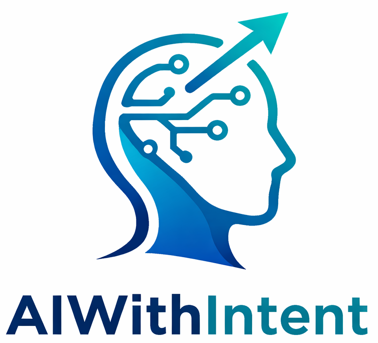

# AIWithIntent Manifesto

  

  <b>Think first. Prompt later.</b> 
  <i>Piensa primero. Promptea después.</i>

  
  

---

### 📜 The AIWithIntent Manifesto

We are discovering better ways of using artificial intelligence in software development by doing it and helping others do it. Through this work, we have come to value:

- **Intentional thinking** over impulsive prompting  
- **Problem definition** over immediate execution  
- **Designed prompts** over improvised interactions  
- **Efficiency and sustainability** over excessive consumption  
- **Maintaining human control** over blind reliance on AI  

That is, while there is value in the items on the right, we value the items on the left more.

---

### 🔍 Principles behind the Manifesto

We follow these principles:

1. **Understand before prompting**  
   Every interaction with AI begins with a clear understanding of the problem.

2. **Design prompts**  
   Prompts are not random text — they are artifacts of design.

3. **Minimize unnecessary iterations**  
   Trial and error without reasoning is a sign of a poor approach.

4. **Be aware of cost and impact**  
   Token usage has economic and energy implications.

5. **Maintain human control**  
   AI assists, but the human decides and is responsible for the outcome.

6. **Prefer clarity over verbosity**  
   Clear inputs produce better outputs with less waste.

7. **Validate results critically**  
   Never assume AI responses are correct — they must be verified.

8. **Continuously refine the approach**  
   Each interaction is an opportunity to improve the use of AI.

---

### 🧩 Core Belief

> **AI is a tool. Intent is the driver.**

---

### 🤝 Contributing

This manifesto is a living document. We welcome contributions that improve clarity or alignment with these principles.

---

> **Use AI deliberately. Not impulsively.**